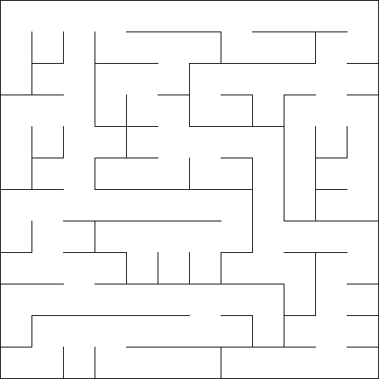

# Mazes

This repository contains my Python translation of the Ruby code contained in the book _Mazes for Programmers_ by Jamis 
Buck.

Created so far:
* Cell class
* Grid class
* Binary Tree algorithm
* Sidewinder algorithm

The Grid class can generate mazes in two ways: as ASCII art in the terminal, and by rendering the maze as a .png file 
using Pillow.

ASCII representation of a Binary Tree maze:

PNG render of a Binary Tree maze:

PNG render of a Sidewinder maze:

